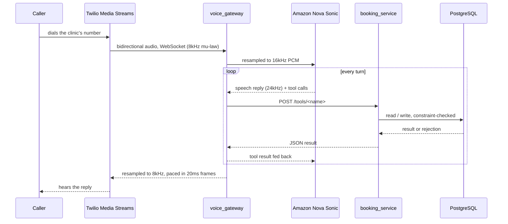
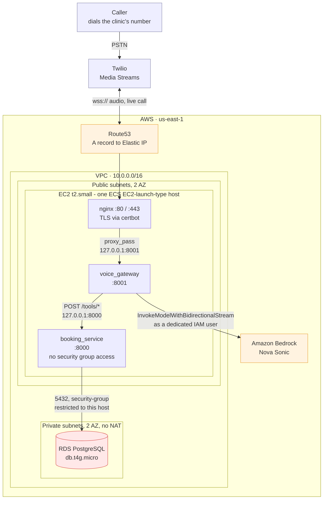

# Dental Desk AI

A real-time, speech-to-speech voice agent that answers a phone call over the
PSTN and books dentist appointments end to end — no IVR menu, no keypad, no
app on the caller's side. Built on Amazon Nova Sonic, Twilio Media Streams,
FastAPI, and PostgreSQL.

A caller dials in, talks naturally (and can interrupt mid-sentence), and by
the end of the call has a real, conflict-free appointment written into the
clinic's diary.

## How a call flows



Two services, one database:

- **`voice_gateway`** — terminates the Twilio Media Stream, converts audio
  between telephony format (8kHz mu-law) and what Nova Sonic needs (16kHz
  in / 24kHz out), handles barge-in (caller talks over the AI mid-reply),
  and executes tool calls the model makes during the conversation.
- **`booking_service`** — a stateless FastAPI app that owns the actual
  business rules: patient lookup, doctor schedules, slot-finding, and
  booking. Every route is `POST /tools/<name>`, designed to be called
  directly by an LLM's tool-use loop.
- **PostgreSQL** — the source of truth, including two `EXCLUDE USING gist`
  constraints that make double-booking a database-level impossibility, not
  an application-level check that a bug could skip.

A more detailed walkthrough of the repo layout, the schema, and the
overlap-constraint logic is in [`docs/chairside.excalidraw`](docs/chairside.excalidraw)
(open at [excalidraw.com](https://excalidraw.com) or with the Excalidraw
VS Code extension).

## Why the AI can't invent details

The model is never trusted to hold a fact on its own. A name, date of
birth, or phone number goes through a strict collect → read back → confirm
cycle, each step backed by its own tool — and the tools that write to the
database (`registerPatientTool`, `bookAppointmentTool`, etc.) refuse to run
until the relevant confirmation has actually happened *in that call*. Of
the 15 tools the model has access to, 8 exist purely as this guardrail
layer; only 6 touch clinic data directly.

Double-booking prevention works the same way, one layer further down:
`excl_doctor_overlap` and `excl_patient_overlap` are exclusion constraints
on the `appointments` table itself. The application can't force a
conflicting booking through even if it tried — Postgres rejects the insert.

See [`services/voice_gateway/app/bedrock_stream.py`](services/voice_gateway/app/bedrock_stream.py)
for the full system prompt and tool definitions, and
[`services/booking_service/TOOL_REFERENCE.md`](services/booking_service/TOOL_REFERENCE.md)
for the data model and every tool's request/response shape.

## Running it locally

Requires Docker, an AWS account with Bedrock access (Nova Sonic), and a
Twilio account with a phone number and an ngrok (or similar) tunnel for
Twilio to reach your machine.

```bash
cp .env.example .env   # fill in your own AWS + Twilio credentials
docker compose up --build
make seed-db           # resets the DB to demo doctors/patients
```

Point the Twilio number's voice webhook at `<your-tunnel>/twilio/voice`,
then call it.

```bash
make test               # booking_service tool checks (find-patient, get-doctor, ...)
make seed-db && make test-book-appointment   # booking + double-booking checks
make health              # liveness/readiness of both services
```

Manual voice-side test scenarios, including a full example call transcript,
are in [`services/voice_gateway/TEST_SCENARIO_ROUTINE_BOOKING.md`](services/voice_gateway/TEST_SCENARIO_ROUTINE_BOOKING.md).

## Deploying to AWS

[`terraform/`](terraform/) provisions this as real infrastructure —
EC2 + ECS (EC2 launch type) running both containers, RDS PostgreSQL,
ECR, and every secret delivered through SSM `SecureString` rather than a
plaintext env var. See [`terraform/README.md`](terraform/README.md) for
what it provisions and how to apply it.



`booking_service` has no entry in any security group — the only way to
reach it is a loopback call from `voice_gateway` on the same host.
ECR image pulls and the SSM secret resolution that feeds both
containers happen at deploy/task-start time, not on the call path
above — see [`terraform/README.md`](terraform/README.md) for those.

## What it can do today

- Recognize a returning patient by name + date of birth, and offer the
  dentist they've seen before
- Register a new patient from scratch
- Take a phone number by voice (US and international) or by offering the
  caller ID on file
- Find the earliest open slot for one dentist or across all of them,
  respecting working hours and time off
- Judge urgency from the caller's description and pick an appointment type
- Handle being talked over mid-sentence
- End the call on its own once the caller is done

## What's not built yet

- Cancelling or rescheduling an existing appointment (the schema already
  supports it — `status` can move to `Cancelled`/`Rescheduled` and the slot
  frees immediately; there's just no tool exposed for it yet)
- SMS/email confirmation after booking
- Any clinical advice, or handling more than one appointment per call
- Auth on `booking_service` — it currently trusts anything inside the
  Docker network, which is fine for a private demo and not for production

## Stack

FastAPI · PostgreSQL 16 (`btree_gist`) · Amazon Bedrock (Nova Sonic) ·
Twilio Media Streams · Docker Compose
